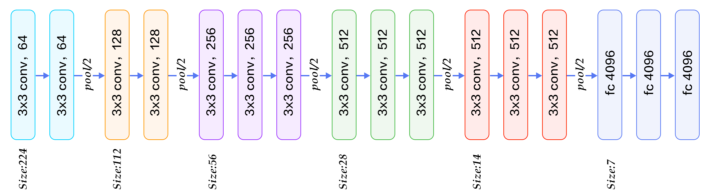
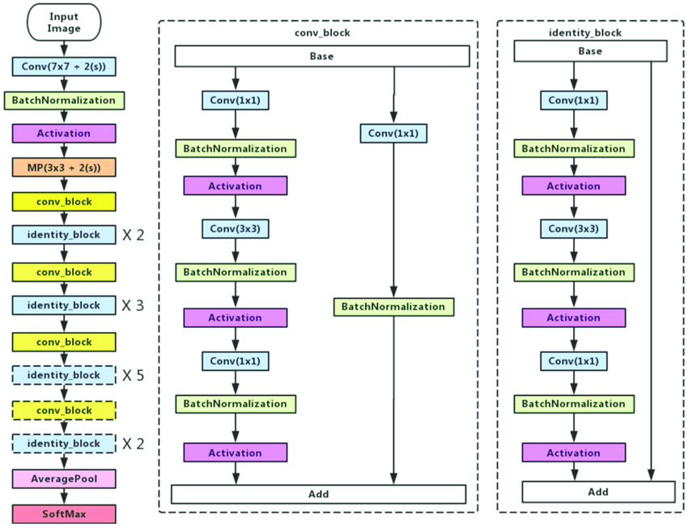

# CIFAR-10_VGG_ResNet
Deep learning project for image classification using CIFAR-10 dataset.

## 1. Introduction

**Architecture of VGG-16**:

**Architecture of ResNet-50**:

## 2. Test Environment

- Google cloud
- CPU: Intel Haswell 8 vCPUs
- Memory: 50G
- GPU: 1 x NVIDIA Tesla V100
- Disk: SSD 100G
- Tensorflow v2.0.0

## 3. VGGNet

### 3.1 My VGGNet structure

- Contains 2 VGG blocks (4 Conv2d layers in total), and 3 FC layers.
- Optimizer: Adam with lr decay.

### 3.2 VGGNet Results

- **No image augmentation**, epochs = 100, batch_size = 128:

|                      | with dropout               | without dropout              |
|----------------------|:--------------------------:|:----------------------------:|
|With batchNorm        | Loss = 0.50, acc = 87.2% (85% at epoch=50) |  Loss > 1.0, acc = 81.5% |
|Without batchNorm     | Loss = 0.51, acc = 83.5% (81% at epoch=50) |  Loss > 1.0, acc = 78.2% |

- **With image augmentation**, epochs = 150, batch_size = 128:

|                      | with dropout               | without dropout              |
|----------------------|:--------------------------:|:----------------------------:|
|With batchNorm        | Loss = 0.33, acc = 89.6% (dropout_rate=0.1) |  Loss = 0.37, acc = 89.3%    |
|Without batchNorm     |                                             |  Loss = 0.46, acc = 86.0%    |

## 4. ResNet

### 4.1 My ResNet structure

- **ResNet21**: Contains 17 Conv2d layers, and 4 FC layers;
- **ResNet33**: Contains 29 Conv2d layers, and 4 FC layers;
- There're two kinds of Conv2d blocks: **convolutional_block** and **identity_block**. Each block contains two Conv2d layers;
- **convolutional_block** increases the number of feature maps, whereas **identity_block** keeps the feature map numbers the same. 
- There's an option to turn on/off dropout, and another option to turn on/off the shortcut path of ResNet
- As oppose to the original ResNet paper where an AveragePooling was used, here I only use MaxPooling. Also more FC layers are added.
- Optimizer: Adam with lr decay.

### 4.2 ResNet Results

- **No image augmentation**, epochs = 150, batch_size = 128:

|                      | with dropout               | without dropout              |
|----------------------|:--------------------------:|:----------------------------:|
|ResNet21, shortcut on |                            |  Loss = 0.95, acc = 86.2%    |
|ResNet21, shortcut off|  Loss = 0.60, acc = 89.5%  |  Loss = 0.95, acc = 86.0%    |
|ResNet33, shortcut on |                            |  Loss = 0.84, acc = 86.4%    |
|ResNet33, shortcut off|  Loss = 0.57, acc = 88.3%  |  Loss = 0.85, acc = 85.9%    |

- **With image augmentation**, epochs = 150, batch_size = 128:

|                      | with dropout               | without dropout              |
|----------------------|:--------------------------:|:----------------------------:|
|ResNet21, shortcut on |                            |  Loss = 0.28, acc = 92.7%    |
|ResNet21, shortcut off| Loss = 0.24, acc = 92.4%   |  Loss = 0.26, acc = 92.7%    |
|ResNet33, shortcut on |                            |  Loss = 0.25, acc = 93.4%    |
|ResNet33, shortcut off|                            |  Loss = 0.24, acc = 92.7%    |

## 5. Conclusion

- **Dropout**, **Batch norm**, **learning-rate decay**, and **data augmentation** can efficiently improve the results;
- **Dropout** is quite useful for smaller training set (CIFAR-10 that contains 40k training images); With large training set (or using augmentated data), the benefit of Dropout is not obvious.
- The **shortcut paths in ResNet** do help when the NN is deep (deep means >15 layers).
- **Dropout in ResNet** is kind of tricky, because I have to balance the dropout rate on the main path and that on the shortcut path.

## 6. References

- A blog comparing baseline VGG model with improved VGG models:
https://machinelearningmastery.com/how-to-develop-a-cnn-from-scratch-for-cifar-10-photo-classification/

- An example of self-built ResNet:
https://github.com/priya-dwivedi/Deep-Learning/blob/master/resnet_keras/Residual_Networks_yourself.ipynb

- A similar study on CIFAR-10:
https://github.com/persistforever/cifar10-tensorflow